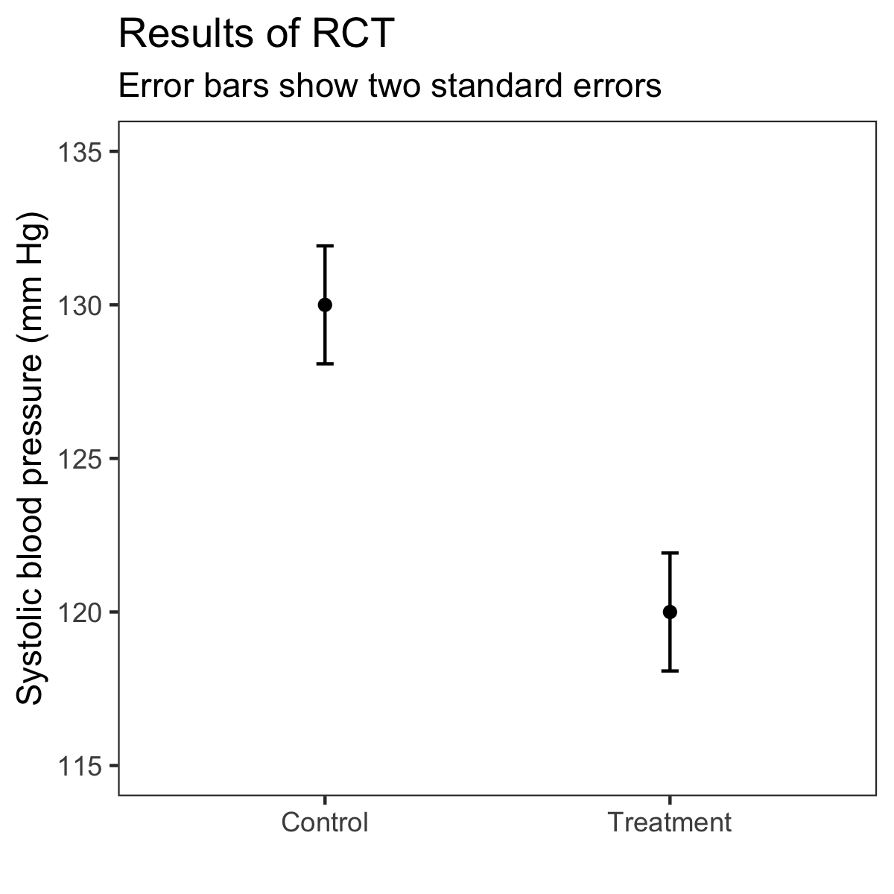
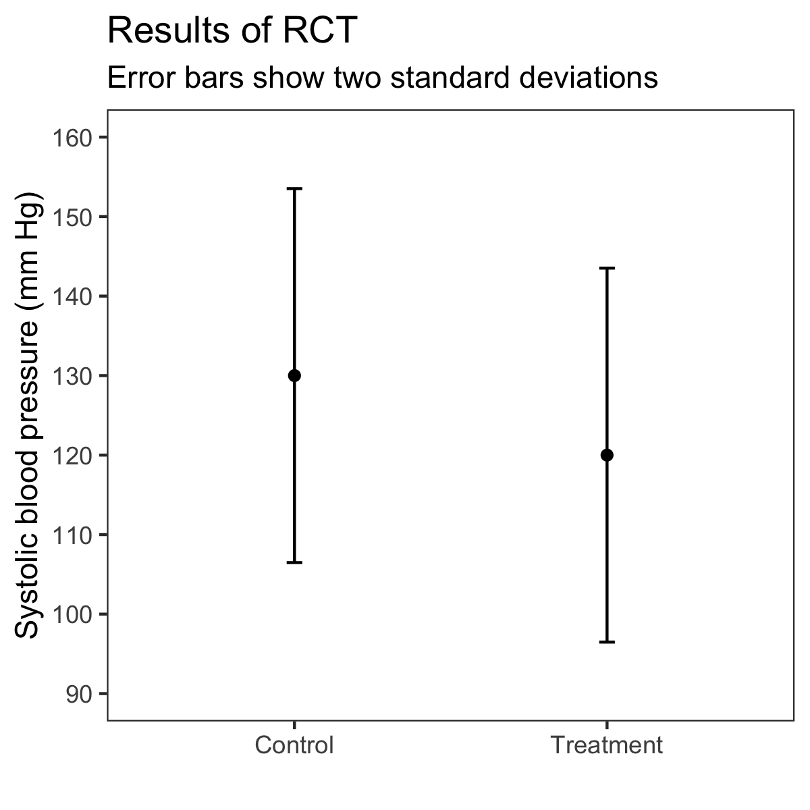
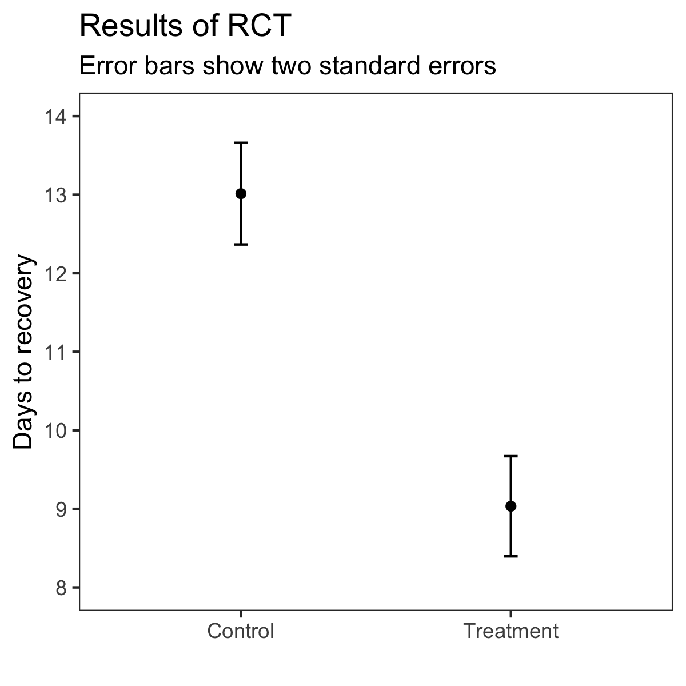
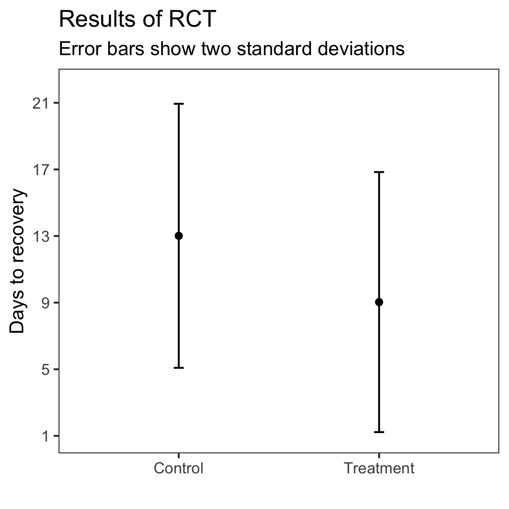

```{r setup, include = F}
library(DT)
library(digest)
library(ggridges)
library(lubridate)
library(knitr)
library(scales)
library(broom)
library(effectsize)
library(boot)
library(coin)
library(ggbeeswarm)
library(here)
library(DescTools)
library(yardstick)
library(patchwork)
library(papaja)
library(tidyverse)


#here::i_am("analysis/analyze_providers.Rmd")
set.seed(1104)

source(here("analysis/shared_analysis.R"))

bootstrapped_median_ci <- function(df, colname, reps = 1000, conf = 0.95) {
  # extract the requested column as a vector
  x <- pull(df, colname)
  
  # run the bootstrap and rename columns
  result <- data.frame(median = median(x),
                       boot.ci(boot(x, function(y, ndx) { median(y[ndx])}, reps), conf = conf, type = "basic")$basic) %>%
    select(lower = V4, median, upper = V5)
  
  return(result)
}
```

# Set constants
```{r set-constants}
# set style
theme_set(theme_bw())

# set figure directory
figure_dir <- here("analysis/figures")


# ground truth distributions for this experiment
true_dists <- data.frame(distribution = c("control", "treatment",
                                          "control", "treatment"),
                         mean = c(130, 120, 13, 9),
                         sd = c(12, 12, 4, 4),
                         medication_type = c('Blood pressure scenario', 'Blood pressure scenario',
                                         'COVID-19 scenario', 'COVID-19 scenario'))

# ground truth cohen's d and probability of superiority (auc) for this experiment
# note: exact empirical estimates for Cohen's D were c(1.28, 1.02), but using true population values
# these will be identical in pre-registered experiment
true_effects <- data.frame(medication_type = c('Blood pressure scenario', 'COVID-19 scenario'),
                           cohens_d = c((130-120)/12, (13 - 9)/4)) %>%
                           mutate(auc = pnorm(cohens_d / sqrt(2)))

```

# Load and clean data

```{r load-data}

# read in responses
preprocess_df <- function(dataframe, start_varname = "ts_start", submit_varname="ts_final_submit") {
  # use combination of worker_id and assignment_id
  # as the unique participant id
  sha1 <- Vectorize(sha1)
  dataframe <- dataframe %>%
    mutate(
      original_worker_id = worker_id,
      worker_id = sha1(paste(worker_id, assignment_id, sep=""))
    )

  # get list of completed assignments
  completed_assignments <- dataframe %>%
    filter(variable == submit_varname) %>%
    distinct(worker_id)
  
  # limit to completed assignments
  # drop all timestamps except start and submit for now
  dataframe <- dataframe %>%
    inner_join(completed_assignments) %>%
    filter(variable != "id") %>%
    filter(!grepl('^ts', variable) | variable == start_varname | variable == submit_varname) 
  
  # go from turk's "long" format to "wide" format with one variable per column
  dataframe_spread <- spread(dataframe, variable, value)
  
  # parse all estimates to numbers
  dataframe <- dataframe_spread %>% 
    filter(!is.na(cost_estimate_se)) %>%
    mutate(
      superiority_estimate_se = parse_number(superiority_estimate_se),
      superiority_estimate_sd = parse_number(superiority_estimate_sd),
      cost_estimate_se = parse_number(cost_estimate_se),
      cost_estimate_sd = parse_number(cost_estimate_sd)
    )
  
  # create columns for first and second estimates based on which condition they saw first
  dataframe <- dataframe %>%
    mutate(first_superiority_estimate = (ifelse(first_condition == 'sd', superiority_estimate_sd, superiority_estimate_se)),
           second_superiority_estimate = (ifelse(first_condition == 'sd', superiority_estimate_se, superiority_estimate_sd)),
           first_cost_estimate = (ifelse(first_condition == 'sd', cost_estimate_sd, cost_estimate_se)),
           second_cost_estimate = (ifelse(first_condition == 'sd', cost_estimate_se, cost_estimate_sd))) 
  
  # create column for whether SD estimate is lower than SE estimate
  dataframe <- dataframe %>%
    mutate(superiority_estimate_sd_lower_than_se = ifelse(superiority_estimate_sd < superiority_estimate_se, T, F),
           superiority_estimate_sd_equal_to_se = ifelse(superiority_estimate_sd == superiority_estimate_se, T, F),
           superiority_estimate_sd_higher_than_se = ifelse(superiority_estimate_sd > superiority_estimate_se, T, F),
           cost_estimate_sd_lower_than_se = ifelse(cost_estimate_sd < cost_estimate_se, T, F))
  
  # convert to pretty labels for conditions
  dataframe <- dataframe %>%
    mutate(first_condition_compressed = case_when(first_condition == 'sd' ~ 'SDs',
                                       first_condition == 'se' ~ 'SEs'),
           first_condition = case_when(first_condition == 'sd' ~ 'Saw SDs first',
                                       first_condition == 'se' ~ 'Saw SEs first'),
  #         first_condition = factor(first_condition, levels = c('Saw SEs first', 'Saw SDs first')),
           medication_type = case_when(medication_type == 'blood_pressure' ~ 'Blood pressure scenario',
                                       medication_type == 'covid_19' ~ 'COVID-19 scenario'))
  
  dataframe$first_condition = factor(dataframe$first_condition, levels = c('Saw SEs first', 'Saw SDs first'))
  # extract distribution builder responses
    
  dataframe
}


df.turkers <- read_tsv(here('raw-data/mturk.tsv'), col_types="ccccc") %>%
  preprocess_df(start_varname = "ts_consent_start", submit_varname="ts_submitted_") %>%
  mutate(across(starts_with('ts_'), as.POSIXct)) %>%
  mutate(time_spent = difftime(as.POSIXct(ts_submitted_),
                               as.POSIXct(ts_consent_start),
                               units = "min"))

bin_labels <- df.turkers %>%
  distinct(medication_type, distbuilder_bins) %>%
  rename(label = distbuilder_bins) %>%
  mutate(label = strsplit(as.character(label), ",")) %>%
  unnest(label) %>%
  mutate(label = gsub('to', '-', label),
         label = gsub('[^0-9-]', '', label)) %>%
  group_by(medication_type) %>%
  mutate(bin = row_number()) %>%
  extract(label, into = c("lower", "upper"), regex="([0-9]+)-([0-9]+)", remove = F) %>%
  mutate(lower = as.numeric(lower),
         upper = as.numeric(upper),
         center = (lower + upper) / 2)

```

There were `r nrow(df)` people who completed the experiment in total.

## Remove anyone who had an ill-formed response

```{r filter}
df.turkers <- df.turkers %>% drop_na(matches('(superiority|cost)_estimate_'))
nrow(df.turkers)
```

# Design

This was a mixed between-subjects and within-subjects experiment.

For the between-subjects part, people were randomly assigned to see information about one of two medication types (stored in the variable `medication_type`): one for blood pressure or one for COVID-19.

For the within-subjects part, each person saw two different visual presentations of the information about this medication, one showing means and standard erorrs (SEs) and one showing means and standard deviations (SDs). Everyone saw the same visualizations of the same underlying data, it was just a matter of which they saw first. They were randomly assigned to see either SEs or SDs first, after which they saw the other visualization. The variable `first_condition` contains the visualization type they saw first.

Here are links to all four conditions:

|  | **first_condition: Saw SEs first** | **first_condition: Saw SDs first** |
|-|-|-|
| **medication_type: blood pressure** | http://jhofman.github.io/medical-effects/?medication_type=blood_pressure&condition=se  | http://jhofman.github.io/medical-effects/?medication_type=blood_pressure&condition=sd   |
| **medication_type: covid-19** | http://jhofman.github.io/medical-effects/?medication_type=covid_19&condition=se  | http://jhofman.github.io/medical-effects/?medication_type=covid_19&condition=sd  |

We also gave a text-based explanation of the underlying distributions and what the error bars meant.

When seeing SDs, people were shown this text: "Outcomes were approximately normally distributed in both groups before and after the treatment, with roughly equal percentages of patients falling above and below the average. The error bars in the figure show two standard deviations above and below the average in each group. Predictive intervals like these are constructed such that they should, in the long run, contain outcomes for 95% of similar patients in future studies."

When seeing SEs, people were shown this instead: "Outcomes were approximately normally distributed in both groups before and after the treatment, with roughly equal percentages of patients falling above and below the average. The error bars in the figure show two standard errors above and below the average in each group. Confidence intervals like these are constructed such that 95% percent of them should, in the long run, contain the true average for similar patients in future studies."

# Sanity checks

## Randomization check

Randomization looks to be roughly balanced across conditions. The COVID-19 / SE first condition counts are a bit low, small chance that fewer people are completing that condition but probably just a fluke and not a statistically significant difference.

```{r check-random-assignment}
counts <- df.turkers %>%
  count(medication_type, first_condition)

kable(counts)

chisq.test(counts$n)
```

## Time spent on the experiment

The median time to complete the experiment was `r median(df.turkers$time_spent)` minutes. The plot below is limited to participants who completed in 100 minutes or less, excluding the top `r round(mean(df.turkers$time_spent > 100)*100 *10)/10` percent of outliers in terms of completion time.

```{r time-spent}
ggplot(df.turkers, aes(x = time_spent)) +
  geom_histogram() +
  facet_wrap(~ medication_type) +
  labs(x = "Time spent in minutes",
       y = "Number of participants",
       title = "Time spent on the experiment by medication scenario") +
  xlim(c(0,60))
```

# Primary hypotheses

## Estimated probability of superiority 

After seeing information about the medication along with a figure, we asked people to estimate the probability of superiority for the treatment over the control condition. Specifically, we asked "What is your best estimate of the probability that a randomly selected patient in the treatment group recovered more quickly than a randomly selected patient in the control group? (A 50% probability would indicate no difference in outcomes between the treatment and control groups.)"

### Between-subjects effect of first visualization seen on first probability of superiority estimate

This looks at just the between-subjects effect that seeing SEs vs. SDs had by comparing people's responses to only the first visualization condition they saw, ignoring the second estimates. For both medication types, people estimated the probability of superiority to be higher, on average, when they saw visualizations with SEs than with SDs.

#### Plots

This is plotted in two ways below, first means + one standard error, and then full distributions of responses. In the second type of plot the means and standard errors are indicated by points and horizontal error bars.

It's interesting---and a bit puzzling---to see how the average estimates compare to the actual probabilities of superiorities, indicated by the dashed lines in each panel.

The distributions show that SEs result in many more "close to 100%" type responses.

```{r}
turkers_estimated_psup <- plot_beeswarm_two_conditions_with_truth(df.turkers, true_effects, "first_condition", "first_superiority_estimate") +
  facet_wrap(~ medication_type) +
  labs(y="Estimated probability of superiority") +
  xlab("First visualization seen")

turkers_estimated_psup
```

```{r}
ggsave("figures/turkers_estimated_psup.pdf", width=6, height=4)
```

```{r}
summary_stats_providers <- df.turkers %>% group_by(medication_type, first_condition) %>%
  summarize(mu=mean(first_superiority_estimate),
            se=sd(first_superiority_estimate)/sqrt(n()))

blood_se_first_mu <- (summary_stats_providers %>% filter(medication_type == "Blood pressure scenario" & first_condition == "Saw SEs first"))$mu
blood_sd_first_mu <- (summary_stats_providers %>% filter(medication_type == "Blood pressure scenario" & first_condition == "Saw SDs first"))$mu
covid_se_first_mu <- (summary_stats_providers %>% filter(medication_type == "COVID-19 scenario" & first_condition == "Saw SEs first"))$mu
covid_sd_first_mu <- (summary_stats_providers %>% filter(medication_type == "COVID-19 scenario" & first_condition == "Saw SDs first"))$mu

blood_psup_test <- (df.turkers %>%
  filter(medication_type == "Blood pressure scenario") %>%
  t.test(first_superiority_estimate ~ first_condition, data = .) %>%
  apa_custom())$statistic %>%
  remove_dollar_signs()

covid_psup_test <- (df.turkers %>%
  filter(medication_type == "COVID-19 scenario") %>%
  t.test(first_superiority_estimate ~ first_condition, data = .) %>%
  apa_custom())$statistic %>%
  remove_dollar_signs()
  
# Extreme values

blood_extreme_se_perc <- round(100*(df.turkers %>%
  filter(medication_type == "Blood pressure scenario" & first_condition == "Saw SEs first") %>%
  mutate(extreme = first_superiority_estimate > 90) %>%
  summarize(prop_extreme = mean(extreme)))$prop_extreme)

blood_extreme_sd_perc <- round(100*(df.turkers %>%
  filter(medication_type == "Blood pressure scenario" & first_condition == "Saw SDs first") %>%
  mutate(extreme = first_superiority_estimate > 90) %>%
  summarize(prop_extreme = mean(extreme)))$prop_extreme)

covid_extreme_se_perc <- round(100*(df.turkers %>%
  filter(medication_type == "COVID-19 scenario" & first_condition == "Saw SEs first") %>%
  mutate(extreme = first_superiority_estimate > 90) %>%
  summarize(prop_extreme = mean(extreme)))$prop_extreme)

covid_extreme_sd_perc <- round(100*(df.turkers %>%
  filter(medication_type == "COVID-19 scenario" & first_condition == "Saw SDs first") %>%
  mutate(extreme = first_superiority_estimate > 90) %>%
  summarize(prop_extreme = mean(extreme)))$prop_extreme)

blood_extreme_test <- (df.turkers %>%
  filter(medication_type == "Blood pressure scenario") %>%
  mutate(extreme = first_superiority_estimate > 90) %>%
  t.test(extreme ~ first_condition, data=.) %>%
  apa_custom())$statistic %>%
  remove_dollar_signs()

covid_extreme_test <- (df.turkers %>%
  filter(medication_type == "COVID-19 scenario") %>%
  mutate(extreme = first_superiority_estimate > 90) %>%
  t.test(extreme ~ first_condition, data=.) %>%
  apa_custom())$statistic %>%
  remove_dollar_signs()

c(blood_psup_test, covid_psup_test, blood_extreme_test, covid_extreme_test)
```

#### Significance tests

Our primary, confirmatory hypothesis is that participants will estimate a greater probability of superiority for the treatment when the results of a hypothetical RCT communicate inferential uncertainty (i.e., by displaying standard errors around a point estimate) than when these results communicate outcome uncertainty (i.e., by displaying standard deviations).

The first set of tests of this hypothesis is a between-subjects test using two separate, independent-groups t-tests. Specifically, within each of the two medical scenarios, we compare probability of superiority estimates between participants who see the inferential uncertainty condition first to participants who see the outcome uncertainty condition first.

```{r first-superiority-estimate-sig-test}

df.turkers %>% 
  group_by(medication_type) %>% 
  do(tidy(t.test(first_superiority_estimate ~ first_condition,
                 data = .,
                 conf.level = 0.95,
                 alternative = c("greater")))) %>%
  kable()

```

We see a statistically significant difference: in both medical scenarios, those who saw SEs first gave higher estimates, on average, than those who saw SDs first. This supports our primary hypothesis.

### Within-subjects effect of seeing one visualization vs. the other on probability of superiority

This considers both estimates that people made, comparing their estimated probability of superiority for the SD visualization to the same estimate for the SE visualization. This is broken down by which medication type they were shown and which visualization they saw first. 

#### Plots

Regardless of which visualization people saw first, they estimated the probability of superiority to be higher when they saw SEs compared to SDs.

```{r}
plot_data_turkers <- df.turkers %>%
  mutate(diff_superiority_se_vs_sd = superiority_estimate_se - superiority_estimate_sd) %>%
  group_by(medication_type) %>%
  summarize(mu = mean(diff_superiority_se_vs_sd),
            se = sd(diff_superiority_se_vs_sd) / sqrt(n())) %>% 
  mutate(y = 1:n())

kable(plot_data_turkers)

df.turkers %>%
  mutate(diff_superiority_se_vs_sd = superiority_estimate_se - superiority_estimate_sd) %>%
  ggplot(aes(x=medication_type, y=diff_superiority_se_vs_sd)) +
    geom_point(mapping=aes(color=medication_type), position = position_jitter(width=0.1)) +
  #  scale_color_manual(values=c("#af8dc3", "#7fbf7b")) +
    stat_summary(fun = mean, geom = "point", size=1.2) +
    stat_summary(fun.data="mean_se",  fun.args = list(mult=1), 
                 geom="errorbar", color = "black", width=0.1) +
    theme(legend.position = "none") +
  geom_hline(yintercept = 0, linetype = 'dashed') +
  xlab("Scenario") +
  ylab("Drop in estimated probability of superiority\nwhen seeing SDs vs. SEs")
```
```{r}
ggsave(here("analysis/figures/turkers_within_subjects_drop_in_psup.pdf"), width=4, height=4)
```

```{r}
within_subjects_diff_statistics <- df.turkers %>%
  mutate(diff_superiority_se_vs_sd = superiority_estimate_se - superiority_estimate_sd) %>%
  group_by(medication_type) %>%
  summarize(
    mu=mean(diff_superiority_se_vs_sd),
    se=sd(diff_superiority_se_vs_sd)/sqrt(n())
  )

blood_within_mu <- (within_subjects_diff_statistics %>% filter(medication_type == "Blood pressure scenario"))$mu
blood_within_se <- (within_subjects_diff_statistics %>% filter(medication_type == "Blood pressure scenario"))$se
covid_within_mu <- (within_subjects_diff_statistics %>% filter(medication_type == "COVID-19 scenario"))$mu
covid_within_se <- (within_subjects_diff_statistics %>% filter(medication_type == "COVID-19 scenario"))$se

ggplot(plot_data_turkers, aes(x = medication_type, y = mu)) +
  geom_pointrange(aes(ymin = mu - se, ymax = mu + se)) +
  geom_hline(yintercept = 0, linetype = 'dashed') +
  #facet_wrap(~ medication_type, scale = "free_x") +
  #scale_y_continuous(lim = c(0, 10)) +
  labs(x = '',
       y = 'Drop in estimated probability of superiority\nwhen seeing SDs vs. SEs',
       title = 'Average drop in probability of superiority estimate when seeing SDs vs. SEs',
       subtitle = 'Bars show one standard error') +
  coord_flip()

scale <- 0.7
df.turkers %>%
  mutate(diff_superiority_se_vs_sd = superiority_estimate_se - superiority_estimate_sd) %>%
  ggplot(aes(x = diff_superiority_se_vs_sd, y = medication_type)) +
  geom_density_ridges(stat = "binline", binwidth = 1, scale = scale) +
  geom_errorbarh(data = plot_data_turkers, aes(x = mu, xmin = mu - se, xmax = mu + se, y = y + scale), height = 0.1) +
  geom_point(data = plot_data_turkers, aes(x = mu, y = y + scale)) +
  coord_cartesian(ylim = c(1.25, 2.25)) +
  labs(x = 'Drop in estimated probability of superiority\nwhen seeing SDs vs. SEs',
       y = 'First visualization seen',
       title = 'Distribution of drop in probability of superiority estimate\nwhen seeing SDs vs. SEs') +
  #facet_wrap(~ medication_type, ncol = 1) +
  theme(legend.position = "none")

```

We can also look at the full set of responses. For each person we plot their two estimates (one for when they saw SDs and one for when they saw SEs) connected by a line. The slope of the line indicates how much they changed their estimates, with a positive slope indicating that the estimate when seeing SEs was higher than when seeing SDs. Negatively-sloped lines are colored blue, and as hypothesized, the majority of people revised in this direction (somewhere between 60 and 70 percent of people, depending on the condition).

```{r both-superiority-estimates}

plot_data <- df.turkers %>%
  select(worker_id, medication_type, first_condition,
         superiority_estimate_sd_lower_than_se,
         superiority_estimate_sd_equal_to_se,
         superiority_estimate_sd_higher_than_se,
         superiority_estimate_sd, superiority_estimate_se) %>%
  gather("variable", "value", superiority_estimate_sd, superiority_estimate_se) %>%
  mutate(variable = case_when(variable == 'superiority_estimate_sd' ~ 'When seeing SDs',
                              variable == 'superiority_estimate_se' ~ 'When seeing SEs'),
         variable = factor(variable, levels = c('When seeing SEs', 'When seeing SDs')))

plot_data %>%
  group_by(medication_type, first_condition) %>%
  summarize(frac_sd_lower_than_se = mean(superiority_estimate_sd_lower_than_se),
            frac_sd_equal_to_se = mean(superiority_estimate_sd_equal_to_se),
            frac_sd_higher_than_se = mean(superiority_estimate_sd_higher_than_se)) %>%
  kable()

ggplot(plot_data, aes(x = variable, y = value, group = worker_id, color = superiority_estimate_sd_lower_than_se)) +
  geom_point() +
  geom_line(alpha = 0.25) +
  facet_grid(medication_type ~ first_condition) +
  labs(x = '',
       y = 'Estimated probability of superiority',
       title = 'Change in probability of superiority estimates when seeing SEs vs. SDs') +
  theme(legend.position = "none")

```

#### Significance tests

The second set of tests of our primary hypothesis is a within-subjects test using two separate, independent-groups t-tests. Specifically, within each of the two medical scenarios, we compute a within-participant change score as participants’ probability of superiority estimate in the inferential uncertainty condition minus their estimate in the outcome uncertainty condition. We test whether there is statistical significance for these change scores being greater than zero.


```{r difference-in-superiority-estimates-sig-test}

df.turkers %>% 
  mutate(diff_superiority_se_vs_sd = superiority_estimate_se - superiority_estimate_sd) %>%
  group_by(medication_type) %>% 
  do(tidy(t.test(x = .$diff_superiority_se_vs_sd,
                 mu = 0,
                 conf.level = 0.95,
                 type = "two.sample",
                 alternative = c("greater")))) %>%
  kable()

```

We see a statistically significant difference: in both medical scenarios, we see that's people's estimates for the probability of superiority were higher, on average, when they made the estimate after seeing SEs compared to making the estimate after seeing SDs, leading to a positive change score. This supports our primary hypothesis.

An alternative is to just look at the fraction of people who had a lower estimate when they saw SDs compared to when they saw SEs, implemented as a sign test. This ignores the magnitude of changes and just considers direction.

```{r frac-sd-lower-than-se-sig-test}

df.turkers %>%
  mutate(diff_superiority_se_vs_sd = superiority_estimate_se - superiority_estimate_sd) %>%
  group_by(medication_type) %>%
  do(tidy(DescTools::SignTest(.$diff_superiority_se_vs_sd, mu = 0)))

```

Again we see a statistically significant difference for both scenarios.

# Additional analyses

## Estimated probability of superiority

### Extreme responses for first probability of superiority estimate

Now we compare extreme responses for participant's probability of superiority estimate. Specifically, what fraction of people in each condition gave a higher than 90% estimate for the first visualization they saw?

```{r }

df.turkers %>%
  group_by(medication_type, first_condition) %>%
  summarize(frac_greater_than_90_percent = mean(first_superiority_estimate > 90)) %>%
  kable()

```

We see that while only a few people who saw SDs estimated the probability of superiority to be over 90%, roughly 20% of people who were shown SEs did so.

### Mean absolute error in first probability of superiority estimate

Now we compare probability of superiority estimates to their true value, as calculated from the Cohen's D value that participants could have inferred from the visualizations if they could do so perfectly.

```{r show-true-effects}
kable(true_effects)
```

```{r first-superiority-estimate-mean-abs-error}

plot_data <- df.turkers %>%
  left_join(true_effects) %>%
  mutate(abs_err = abs(first_superiority_estimate - 100*auc)) %>%
  select(worker_id, medication_type, first_condition, abs_err) %>%
  group_by(medication_type, first_condition) %>%
  summarize(mu = mean(abs_err),
            se = sd(abs_err) / sqrt(n())) %>% 
  group_by(medication_type) %>%
  mutate(y = 1:n())

kable(plot_data)

ggplot(plot_data, aes(x = first_condition, y = mu)) +
  geom_hline(data = true_effects, aes(yintercept = 0), linetype = 'dashed') +
  geom_pointrange(aes(ymin = mu - se, ymax = mu + se)) +
  facet_wrap(~ medication_type) +
  labs(x = 'First visualization seen',
       y = 'MAE in estimated probability of superiority\nfor first visualization seen',
       title = 'Error in probability of superiority estimate for first visualization seen',
       subtitle = 'Bars show one standard error')

```

### Within-subjects effect of seeing one visualization vs. the other on probability of superiority, split by which was seen first

We can repeat our analysis of the within-subjects change in estimates from above, but splitting by which type of visualization people saw first, and we see some evidence suggesting that the drop in probability of superiority estimates is slightly larger for the people who saw SEs first, although doesn't appear to be statistically significant.

```{r difference-in-superiority-estimates-split-by-first-condition}

plot_data <- df.turkers %>%
  mutate(diff_superiority_se_vs_sd = superiority_estimate_se - superiority_estimate_sd) %>%
  group_by(medication_type, first_condition) %>%
  summarize(mu = mean(diff_superiority_se_vs_sd),
            se = sd(diff_superiority_se_vs_sd) / sqrt(n())) %>% 
  group_by(medication_type) %>%
  mutate(y = 1:n())

kable(plot_data)

ggplot(plot_data, aes(x = first_condition, y = mu)) +
  geom_pointrange(aes(ymin = mu - se, ymax = mu + se)) +
  geom_hline(yintercept = 0, linetype = 'dashed') +
  facet_wrap(~ medication_type) +
  labs(x = 'First visualization seen',
       y = 'Drop in estimated probability of superiority\nwhen seeing SDs vs. SEs',
       title = 'Average drop in probability of superiority estimate when seeing SDs vs. SEs',
       subtitle = 'Bars show one standard error')


scale <- 0.7
df.turkers %>%
  mutate(diff_superiority_se_vs_sd = superiority_estimate_se - superiority_estimate_sd) %>%
  ggplot(aes(x = diff_superiority_se_vs_sd, y = first_condition, color = first_condition, fill = first_condition)) +
  geom_density_ridges(stat = "binline", binwidth = 1, scale = scale) +
  geom_errorbarh(data = plot_data, aes(x = mu, xmin = mu - se, xmax = mu + se, y = y + scale), height = 0.1) +
  geom_point(data = plot_data, aes(x = mu, y = y + scale)) +
  coord_cartesian(ylim = c(1.25, 2.25)) +
  labs(x = 'Drop in estimated probability of superiority\nwhen seeing SDs vs. SEs',
       y = 'First visualization seen',
       title = 'Distribution of drop in probability of superiority estimate\nwhen seeing SDs vs. SEs') +
  facet_wrap(~ medication_type, ncol = 1) +
  theme(legend.position = "none")

```

## Estimated value of the treatment

We also asked people to estimate the probability of superiority for the treatment over the control condition. We gave them prices to anchor around to reduce noise in estimates.

For blood pressure we phrased this as follows: "Based on its effectiveness and the price of other medications, how much do you think a 30 day supply of this new medication would be worth to patients with high blood pressure? For reference, a 30 day supply of generic ACE inhibitors, also used to lower blood pressure, costs about $20."

For COVID-19 we phrased this as: "Based on its effectiveness and the price of other medications, how much do you think a 5 day supply of this new medication would be worth to patients hospitalized with COVID-19? For reference, a 5 day supply of the most popular drug used for this purpose costs about $2500."

### Between-subjects effect of first visualization seen on value of treatment estimate

Note that instead of looking at means (as with probability of superiority above), we look at medians here to reduce sensitivity to a handful of extreme responses.

```{r first-cost-estimate}

plot_data_value <- df.turkers %>%
  mutate(direction = ifelse(cost_estimate_sd < cost_estimate_se, T, F)) %>%
  select(worker_id, medication_type, first_condition, direction, first_cost_estimate, second_cost_estimate) %>%
  group_by(medication_type, first_condition) %>%
  do(bootstrapped_median_ci(., "first_cost_estimate", reps = 10000, conf = 0.95)) %>%
  group_by(medication_type) %>%
  mutate(y = 1:n())

estimated_value_blood_se <- plot_data_value %>% filter(medication_type == "Blood pressure scenario" & first_condition == "Saw SEs first")
estimated_value_blood_sd <- plot_data_value %>% filter(medication_type == "Blood pressure scenario" & first_condition == "Saw SDs first")
estimated_value_covid_se <- plot_data_value %>% filter(medication_type == "COVID-19 scenario" & first_condition == "Saw SEs first")
estimated_value_covid_sd <- plot_data_value %>% filter(medication_type == "COVID-19 scenario" & first_condition == "Saw SDs first")

kable(plot_data_value)

ggplot(plot_data_value, aes(x = first_condition, y = median)) +
  geom_pointrange(aes(ymin = lower, ymax = upper)) +
  facet_wrap(~ medication_type, scale = "free_y") +
  labs(x = 'First visualization seen',
       y = 'Estimated value of treatment\nfor first visualization seen',
       title = 'Median value of treatment estimate for first visualization seen',
       subtitle = 'Bars show bootstrapped 95% confidence interval')


# remove outliers for plot
df_trimmed <- df.turkers %>%
  group_by(medication_type) %>%
  filter(cost_estimate_sd > quantile(cost_estimate_sd, 0.025) &
           cost_estimate_sd < quantile(cost_estimate_sd, 0.975) &
           cost_estimate_se > quantile(cost_estimate_se, 0.025) &
           cost_estimate_se < quantile(cost_estimate_se, 0.975) )

scale <- 0.7
ggplot(df_trimmed, aes(x = first_cost_estimate, y = first_condition, color = first_condition, fill = first_condition)) +
  geom_density_ridges(stat = "binline", binwidth = 1, scale = scale) +
  geom_errorbarh(data = plot_data_value, aes(x = median, xmin = lower, xmax = upper, y = y + scale), height = 0.1) +
  geom_point(data = plot_data_value, aes(x = median, y = y + scale)) +
  coord_cartesian(ylim = c(1.25, 2.25)) +
  labs(x = 'Estimated value of treatment\nfor first visualization seen',
       y = 'First visualization seen',
       title = 'Distribution of value of treatment estimates for first visualization seen',
       subtitle = 'Points and bars show medians with 95% bootstrapped confidence intervals') +
  facet_wrap(~ medication_type, ncol = 1, scale = "free") +
  theme(legend.position = "none")
```

Note: in the distribution plot above we've removed the top and bottom 2.5% of outliers within each scenario so the scales are reasonable.

```{r}
ggplot(df.turkers, aes(x = log10(first_cost_estimate), y = first_condition, color = first_condition, fill = first_condition)) +
  geom_density_ridges(stat = "binline", binwidth = 1, scale = scale) +
  geom_errorbarh(data = plot_data_value, aes(x = log10(median), xmin = log10(lower), xmax = log10(upper), y = y + 1), height = 0.1) +
  geom_point(data = plot_data_value, aes(x = log10(median), y = y + 1)) +
  coord_cartesian(ylim = c(1.25, 2.75)) +
  labs(x = 'Estimated log10 value of treatment\nfor first visualization seen',
       y = 'First visualization seen',
       title = 'Distribution of value of treatment estimates for first visualization seen',
       subtitle = 'Points and bars show medians with 95% bootstrapped confidence intervals') +
  facet_wrap(~ medication_type, ncol = 1, scale = "free") +
  theme(legend.position = "none")
```

```{r}

dollars <- function(x) {
  paste("$", comma(x, accuracy=1), sep="")
}

turkers_value_of_treatment <- ggplot(df.turkers, aes(x=first_condition, y = first_cost_estimate)) +
      geom_point(aes(color = first_condition), alpha = 0.70, position = position_jitter(width = 0.25, height = 0.15)) +
      stat_summary(fun = mean, geom = "point", size=1.2) +
      stat_summary(fun.data="mean_se",  fun.args = list(mult=1), 
                   geom="errorbar", color = "black", width=0.1) +
      facet_wrap(~ medication_type, ncol = 2, scale="free") +
      scale_y_log10(breaks = c(1,3,10,30,100,1000, 3000, 10000, 100000), labels = dollars) +
      scale_color_discrete(guide = "none") +
    labs(y = 'Estimated value of treatment\nfor first visualization seen',
         x = '')
turkers_value_of_treatment
```

```{r}
ggsave(here("analysis/figures/turkers_estimated_value_log10.pdf"), width=6, height=4)
```


```{r first-cost-estimate-sig-test}

print("Blood pressure")
blood.median.test <- df.turkers %>%
  filter(medication_type == "Blood pressure scenario") %>%
  median_test(first_cost_estimate ~ first_condition, data = ., alternative = "greater")

blood.median.test.pval <- pvalue(blood.median.test)
blood.median.test.zval <- statistic(blood.median.test)

print("COVID-19")
covid.median.test <- df.turkers %>%
  filter(medication_type == "COVID-19 scenario") %>%
  median_test(first_cost_estimate ~ first_condition, data = ., alternative = "greater")

covid.median.test.pval <- pvalue(covid.median.test)
covid.median.test.zval <- statistic(covid.median.test)

c(blood.median.test, covid.median.test)
```

### Within-subjects effect of seeing one visualization vs. the other on estimated value of treatment

```{r difference-in-cost-estimates}

plot_data <- df.turkers %>%
  mutate(diff_cost_se_vs_sd = cost_estimate_se - cost_estimate_sd) %>%
  group_by(medication_type, first_condition) %>%
  do(bootstrapped_median_ci(., "diff_cost_se_vs_sd", reps = 10000, conf = 0.95)) %>%
  group_by(medication_type) %>%
  mutate(y = 1:n())

kable(plot_data)

ggplot(plot_data, aes(x = first_condition, y = median)) +
  geom_pointrange(aes(ymin = lower, ymax = upper)) +
  facet_wrap(~ medication_type, scale = "free_y") +
  labs(x = 'First visualization seen',
       y = 'Drop in estimated value of treatment\nwhen seeing SDs vs. SEs',
       title = 'Average drop in value of treatment estimate when seeing SDs vs. SEs',
       subtitle = 'Bars show one standard error')


scale <- 0.7
df_trimmed %>%
  mutate(diff_cost_se_vs_sd = cost_estimate_se - cost_estimate_sd) %>%
  ggplot(aes(x = diff_cost_se_vs_sd, y = first_condition, color = first_condition, fill = first_condition)) +
  geom_density_ridges(stat = "binline", binwidth = 1, scale = scale) +
  geom_errorbarh(data = plot_data, aes(x = median, xmin = lower, xmax = upper, y = y + scale), height = 0.1) +
  geom_point(data = plot_data, aes(x = median, y = y + scale)) +
  coord_cartesian(ylim = c(1.25, 2.25)) +
  labs(x = 'Drop in estimated value of the treatment\nwhen seeing SDs vs. SEs',
       y = 'First visualization seen',
       title = 'Distribution of drop in value of treatment estimate\nwhen seeing SDs vs. SEs') +
  facet_wrap(~ medication_type, scale = "free_x", ncol = 1) +
  theme(legend.position = "none")
```

```{r both-cost-estimates}

plot_data <- df.turkers %>%
  group_by(medication_type) %>%
  filter(cost_estimate_sd > quantile(cost_estimate_sd, 0.025) &
           cost_estimate_sd < quantile(cost_estimate_sd, 0.975) &
           cost_estimate_se > quantile(cost_estimate_se, 0.025) &
           cost_estimate_se < quantile(cost_estimate_se, 0.975) ) %>%
  select(worker_id, medication_type, first_condition, cost_estimate_sd_lower_than_se, cost_estimate_sd, cost_estimate_se) %>%
  gather("variable", "value", cost_estimate_sd, cost_estimate_se) %>%
  mutate(variable = case_when(variable == 'cost_estimate_sd' ~ 'When seeing SDs',
                              variable == 'cost_estimate_se' ~ 'When seeing SEs'),
         variable = factor(variable, levels = c('When seeing SEs', 'When seeing SDs')))

(plot_data %>%
    group_by(medication_type, first_condition) %>%
    summarize(mean(cost_estimate_sd_lower_than_se)))

ggplot(plot_data, aes(x = variable, y = value, group = worker_id, color = cost_estimate_sd_lower_than_se)) +
  geom_point() +
  geom_line(alpha = 0.25) +
  facet_grid(medication_type ~ first_condition, scale = "free_y") +
  labs(x = '',
       y = 'Estimated value of the treatment',
       title = 'Change in value of treatment estimates when seeing SEs vs. SDs') +
  theme(legend.position = "none")
```

```{r difference-in-cost-estimates-sig-test}

print("Blood pressure")
df.turkers %>%
  mutate(diff_cost_se_vs_sd = cost_estimate_se - cost_estimate_sd) %>%
  filter(medication_type == "Blood pressure scenario") %>%
  median_test(diff_cost_se_vs_sd ~ first_condition, data = ., alternative = "greater")

print("COVID-19")
df.turkers %>%
  mutate(diff_cost_se_vs_sd = cost_estimate_se - cost_estimate_sd) %>%
  filter(medication_type == "COVID-19 scenario") %>%
  median_test(diff_cost_se_vs_sd ~ first_condition, data = ., alternative = "greater")

```

## Recall of error bar type / meaning

After seeing each visualization and making two estimates (one for probability of superiority and the other for value), people were asked "What kind of error bars were shown in the plot on the previous page?" and given the choices of "Standard errors, showing uncertainty in estimating the average in each condition" as the first choice or "Standard deviations, showing the variation in individual outcomes in each condition" as the second choice. 

### Fraction of people who correctly answered the "what you saw" question the first time around

First let's look at how people did just the first time around, based on the first visualization they saw. People seem to get this correct more often when seeing SD visualizations, perhaps because they naturally think that's what error bars represent.

```{r fraction-correct-first-what-you-saw}

df.turkers %>%
  group_by(medication_type, first_condition) %>%
  mutate(passed_first_check = ifelse(first_condition == 'Saw SEs first',
                                     grepl('se$', what_you_saw_se),
                                     grepl('sd$', what_you_saw_sd))) %>%
  summarize(frac_correct = mean(passed_first_check)) %>%
  kable()
```

### Fraction of people who correctly answered the "what you saw" question both times 

A lower fraction of people got this question right both times.

```{r fraction-correct-both-what-you-saw}

df.turkers %>%
  group_by(medication_type, first_condition) %>%
  summarize(frac_correct = mean(grepl('sd$', what_you_saw_sd) & grepl('se$', what_you_saw_se))) %>%
  kable()

```

## Re-running significance tests for primary hypotheses restricted to people who correctly answered the "what you saw" question both times

As a more stringent test of our primary hypotheses, we limit our attention to participants who correctly answered both questions about what type of error bars they saw. Presumably these people were more aware of what the visualizations they were shown meant. Thus if we see an effect here, this provides more evidence that differences between conditions are due to more than simply confusion about what type of error bars were shown.

### Percent of subjects who recalled seeing SEs by first condition

```{r recall-se-by-condition}
df_recalled_condition_sd <- df.turkers %>%
  filter(first_condition_compressed == "SDs") %>%
  mutate(recalled_se = grepl('sd$', what_you_saw_sd)) %>%
  summarize(recalled_se_mean = mean(recalled_se),
            recalled_se_sd = sd(recalled_se),
            recalled_se_se = recalled_se_sd/sqrt(n()),
            condition="SDs")

df_recalled_condition_se <- df.turkers %>%
  filter(first_condition_compressed == "SEs") %>%
  mutate(recalled_se = grepl('se$', what_you_saw_se)) %>%
  summarize(recalled_se_mean = mean(recalled_se),
            recalled_se_sd = sd(recalled_se),
            recalled_se_se = recalled_se_sd/sqrt(n()),
            condition="SEs")

df_recalled_condition <- rbind(df_recalled_condition_sd, df_recalled_condition_se)

provider_recall_SE_mean <- format(100*signif(df_recalled_condition_se$recalled_se_mean, 3))
provider_recall_SE_mean_95_CI_lower <- format(100*signif(df_recalled_condition_se$recalled_se_mean - 1.96*df_recalled_condition_se$recalled_se_se, 3))
provider_recall_SE_mean_95_CI_upper <- format(100*signif(df_recalled_condition_se$recalled_se_mean + 1.96*df_recalled_condition_se$recalled_se_se, 3))

ggplot(df_recalled_condition, aes(x=condition, y=recalled_se_mean, color=condition)) +
  geom_pointrange(aes(ymin=recalled_se_mean - recalled_se_se, ymax=recalled_se_mean + recalled_se_se)) +
   scale_y_continuous(label=percent, lim=c(0, 1)) +
      theme(legend.position="none") +
    labs(y="% who recalled correct meaning of error bars", x="First saw condition")
```
```{r}
ggsave("./figures/turkers-first-saw-recalled.pdf", width=4, height=4)
```

### Between-subjects effect of first visualization seen on first probability of superiority estimate

```{r retest-first-superiority-estimate}

df_recalled_correct <- df.turkers %>%
  filter(grepl('sd$', what_you_saw_sd) & grepl('se$', what_you_saw_se)) 

plot_data <- df_recalled_correct %>%
  mutate(direction = ifelse(superiority_estimate_sd < superiority_estimate_se, T, F)) %>%
  select(worker_id, medication_type, first_condition, direction, first_superiority_estimate, second_superiority_estimate) %>%
  group_by(medication_type, first_condition) %>%
  summarize(mu = mean(first_superiority_estimate),
            se = sd(first_superiority_estimate) / sqrt(n())) %>% 
  group_by(medication_type) %>%
  mutate(y = 1:n())

kable(plot_data)

ggplot(plot_data, aes(x = first_condition, y = mu)) +
  geom_hline(data = true_effects, aes(yintercept = 100*auc), linetype = 'dashed') +
  geom_pointrange(aes(ymin = mu - se, ymax = mu + se)) +
  facet_wrap(~ medication_type) +
  labs(x = 'First visualization seen',
       y = 'Estimated probability of superiority\nfor first visualization seen',
       title = 'Average probability of superiority estimate for first visualization seen',
       subtitle = 'Bars show one standard error')

df_recalled_correct %>%
  group_by(medication_type) %>% 
  do(tidy(t.test(first_superiority_estimate ~ first_condition,
                 data = .,
                 conf.level = 0.95,
                 alternative = c("greater")))) %>%
  kable()
```

###  Within-subjects effect of seeing one visualization vs. the other on probability of superiority

```{r retest-difference-in-superiority-estimates}

plot_data <- df_recalled_correct %>%
  mutate(diff_superiority_se_vs_sd = superiority_estimate_se - superiority_estimate_sd) %>%
  group_by(medication_type, first_condition) %>%
  summarize(mu = mean(diff_superiority_se_vs_sd),
            se = sd(diff_superiority_se_vs_sd) / sqrt(n())) %>% 
  group_by(medication_type) %>%
  mutate(y = 1:n())

kable(plot_data)

ggplot(plot_data, aes(x = first_condition, y = mu)) +
  geom_pointrange(aes(ymin = mu - se, ymax = mu + se)) +
  geom_hline(yintercept = 0, linetype = 'dashed') +
  facet_wrap(~ medication_type) +
  labs(x = 'First visualization seen',
       y = 'Drop in estimated probability of superiority\nwhen seeing SDs vs. SEs',
       title = 'Average drop in probability of superiority estimate when seeing SDs vs. SEs',
       subtitle = 'Bars show one standard error')

df_recalled_correct %>%
  mutate(diff_superiority_se_vs_sd = superiority_estimate_se - superiority_estimate_sd) %>%
  group_by(medication_type) %>% 
  do(tidy(t.test(x = .$diff_superiority_se_vs_sd,
                 mu = 0,
                 conf.level = 0.95,
                 type = "two.sample",
                 alternative = c("greater")))) %>%
  kable()
```

## Distribution builder estimates

```{r}
distbuilder_values_by_worker_turkers <- df.turkers %>% 
  select(worker_id, medication_type, first_condition,
         superiority_estimate_sd, superiority_estimate_se,
         distbuilder_control_sd, distbuilder_treatment_sd,
         distbuilder_control_se, distbuilder_treatment_se) %>% 
  gather("distribution", "values", matches('distbuilder')) %>%
  mutate(values = str_remove(values, '\\['),
         values = str_remove(values, ']'),
         count = strsplit(as.character(values), ",")) %>%
  unnest(count) %>%
  group_by(worker_id, first_condition, medication_type,
           superiority_estimate_sd, superiority_estimate_se,
           distribution) %>%
  mutate(count = as.numeric(count),
         bin = row_number()) %>%
  left_join(bin_labels) %>%
  rename(bin_number = bin, bin = label) %>%
  mutate(bin = reorder(bin, bin_number))


plot_data <- merge(bin_labels, true_dists, all.x = T, all.y = T) %>%
  mutate(true_frac = pnorm(upper + 1/2, mean = mean, sd = sd) - pnorm(lower - 1/2, mean = mean, sd = sd))

# plot only first responses by first condition
plot_data_distbuilder_turkers <- distbuilder_values_by_worker_turkers %>%
  filter((grepl('SDs', first_condition) & grepl('sd$', distribution)) | (grepl('SEs', first_condition) & grepl('se$', distribution))) %>%
  filter(!is.na(bin)) %>%
  mutate(treatment_or_control = ifelse(grepl('treatment', distribution), 'treatment', 'control'),
         se_or_sd = ifelse(grepl('se$', distribution), 'When seeing SEs', 'When seeing SDs')) %>%
  group_by(distribution, treatment_or_control, first_condition, medication_type, bin, bin_number, center) %>%
  summarize(total_count = sum(count)) %>%
  group_by(medication_type, distribution) %>%
  mutate(frac = total_count / sum(total_count))
  
turkers_all_first_condition_distbuilder <- ggplot(plot_data_distbuilder_turkers, aes(x = center, y = frac)) +
    #geom_vline(data = true_dists,
    #           aes(xintercept = mean, color = distribution),
    #           linetype = 'dotted') +
    geom_segment(aes(color = treatment_or_control, xend=center), yend=0, stat = "identity", position = "identity", alpha = 0.5, size=3) +
    geom_line(data = plot_data, aes(x = center, y = true_frac, color = distribution), linetype = 'solid') +
    facet_grid(first_condition ~ medication_type, scale = "free_x") +
    labs(x = 'Bin',
         y = 'Percent of balls placed in each bin'
         #title = 'Distribution builder responses across all participants'#,
         #subtitle = 'Dotted lines show true means'
         ) +
    scale_y_continuous(label = scales::label_percent(accuracy = 1L)) +
    scale_color_manual(name="", labels=c("Placebo", "New medicine"), values=c("#7fbf7b", "#af8dc3")) +
    theme_minimal() +
    theme(legend.position = c(0.5, 0.9),
          legend.title = element_blank(),
          axis.text.x=element_text(angle=90, hjust=1))

turkers_all_first_condition_distbuilder
```

```{r}
ggsave("figures/turkers_all_first_condition_distbuilder_responses.pdf", width=4, height=4)
```

### Distbuilder estimates

Implied probability of superiorities
```{r}
get_implied_auc_by_worker <- function(values_by_worker) {
  values_by_worker %>%
    #mutate(estimate = ifelse(first_condition == "Saw SDs first", superiority_estimate_sd, superiority_estimate_se)) %>%
    mutate(
      is_sd_dist = grepl("_sd$", distribution),
      is_treatment = grepl("_treatment_", distribution)
    ) %>%
    filter((first_condition == "Saw SDs first" & is_sd_dist) | (first_condition == "Saw SEs first" & !is_sd_dist)) %>%
    group_by(worker_id, first_condition, medication_type) %>%
    mutate(is_treatment = as.factor(is_treatment)) %>%
    do({
      data.frame(is_treatment = rep(.$is_treatment, .$count),
                 x = rep(.$center, .$count))
    }) %>%
    yardstick::roc_auc(is_treatment, x) %>%
    select(-.metric, -.estimator, auc = .estimate) %>%
    ungroup()
  
  
}
implied_auc_by_worker <- get_implied_auc_by_worker(distbuilder_values_by_worker_turkers)

model.implied.psup <- lm(auc ~ medication_type + first_condition, data = implied_auc_by_worker)
distbuilder.psup.est <- format(signif(-100*(tidy(model.implied.psup) %>% filter(term == "first_conditionSaw SDs first"))$estimate, 3))
distbuilder.psup.ttest <-  apa_print(model.implied.psup)$statistic$first_conditionSaw_SDs_first
summary(model.implied.psup)
```

Implied estimates

```{r}
implied_auc_by_turker <- get_implied_auc_by_worker(distbuilder_values_by_worker_turkers)
model.implied.psup.turker <- lm(auc ~ medication_type + first_condition, data = implied_auc_by_turker)
summary(model.implied.psup.turker)
```
```{r}
distbuilder.psup.est.turk <- format(signif(100*(tidy(model.implied.psup.turker) %>% filter(term == "first_conditionSaw SDs first"))$estimate, 3))
distbuilder.psup.ttest.turk <-  apa_print(model.implied.psup.turker)$statistic$first_conditionSaw_SDs_first
plot.implied.psups.turker <- plot_implied_auc(implied_auc_by_turker)
plot.implied.psups.turker
```
```{r}
ggsave("figures/turkers_implied_distbuilder_psups.pdf", width=5, height=3)
```

## Correlations between probability of superiority estimates and estimated value of treatment

### Between-subjects on first estimate

```{r corr-btwn-first-superiority-and-first-cost-estimates}
df.turkers %>%
  group_by(medication_type) %>%
  filter(first_cost_estimate > quantile(first_cost_estimate, 0.05) &
         first_cost_estimate < quantile(first_cost_estimate, 0.95)) %>%
  summarize(spearman_cor = cor(first_superiority_estimate, first_cost_estimate, method = "spearman")) %>%
  kable()

df.turkers %>%
  group_by(medication_type) %>%
  filter(first_cost_estimate > quantile(first_cost_estimate, 0.05) &
         first_cost_estimate < quantile(first_cost_estimate, 0.95)) %>%
  ggplot(aes(x = first_superiority_estimate, y = first_cost_estimate)) +
  geom_point(alpha = 0.10) +
  #geom_smooth() +
  facet_grid(medication_type ~ first_condition, scale = "free")
```

```{r direction-of-superiority-and-cost-estimates}

plot_data <- df.turkers %>%
  group_by(medication_type) %>%
  mutate(diff_superiority_se_vs_sd = superiority_estimate_se - superiority_estimate_sd,
         direction_superiority_se_vs_sd = case_when(diff_superiority_se_vs_sd > 0 ~ 'Increased',
                                                    diff_superiority_se_vs_sd == 0 ~ 'No change',
                                                    diff_superiority_se_vs_sd < 0 ~ 'Decreased'),
         diff_cost_se_vs_sd = cost_estimate_se - cost_estimate_sd,
         direction_cost_se_vs_sd = case_when(diff_cost_se_vs_sd > 0 ~ 'Increased',
                                             diff_cost_se_vs_sd == 0 ~ 'No change',
                                             diff_cost_se_vs_sd < 0 ~ 'Decreased')) %>%
  count(direction_superiority_se_vs_sd, direction_cost_se_vs_sd) %>%
  mutate(frac = n / sum(n))

plot_data %>%
  kable()

plot_data %>%
  ungroup() %>%
  mutate(direction_superiority_se_vs_sd = fct_relevel(direction_superiority_se_vs_sd, c("Decreased", "No change", "Increased")),
         direction_cost_se_vs_sd = fct_relevel(direction_cost_se_vs_sd, c("Decreased", "No change", "Increased"))) %>%
  ggplot(aes(x = direction_superiority_se_vs_sd, y = direction_cost_se_vs_sd)) +
  geom_tile(aes(fill = frac, color = frac)) +
  geom_text(aes(label = sprintf('%0.0f%%', 100*frac))) +
  facet_wrap(~ medication_type) +
  scale_color_gradient(low = "white",
                      high = "red") +
  scale_fill_gradient(low = "white",
                      high = "red") +
  theme_minimal() +
  theme(
    legend.title = element_blank(),
    plot.background = element_blank(),
    panel.grid.minor = element_blank(),
    panel.grid.major = element_blank(),
    panel.background = element_blank(),
    panel.border = element_blank(),
    axis.line = element_blank(),
    axis.ticks = element_blank()
    #axis.text.x = element_blank(),
    #axis.text.y = element_blank()
    #axis.title.x = element_blank(),
    #axis.title.y = element_blank()
  ) +
  labs(title = 'Directional change in superiority and cost estimates',
       subtitle = 'Sum of the nine percentages in each panel is 100%',
       x = 'Change in superiority estimate from SDs to SEs',
       y = 'Change in cost estimate from SDs to SEs')
```

# Free response feedback
```{r free-response-feedback}

df.turkers %>%
  filter(feedback != "") %>%
  select(medication_type, first_condition, superiority_estimate_se, superiority_estimate_sd, feedback) %>%
  datatable(
    caption = "Feedback",
    filter = "top",
    rownames = FALSE,
    options = list(autoWidth = TRUE)
  )

```

# R Session information with package versions

```{r session-info}

sessionInfo()

```
